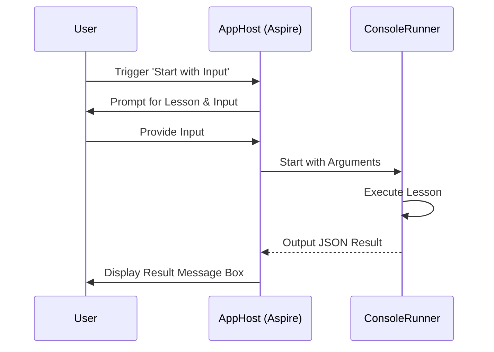

# AI Observability and Evaluation Workshop

Conducted by Matt Eland and Victor Frye from [Leading EDJE](https://LeadingEDJE.com)

See [AGENDA.md](AGENDA.md) for the workshop schedule and exercises.

## Setup and Requirements

- [.NET 10.0 SDK](https://dotnet.microsoft.com/en-us/download/dotnet/10.0)
- [Tooling compatible with Aspire (VS 2022 / 2026), VS Code, Rider, Cursor, etc.](https://learn.microsoft.com/en-us/dotnet/aspire/fundamentals/setup-tooling)

Some examples will use containerized resources. For these you will need either:

- [Docker Desktop](https://www.docker.com/products/docker-desktop) * licensing may not be advisable on corporate machines
- [Podman](https://podman.io/)

We recommend launching the application in advance with a stable internet connection to allow the appropriate container images to be downloaded.

### Azure Cloud Resources (Optional)

Aside from the Azure Content Safety portion, all workshop contents can be run using local models via Ollama, using advanced cloud-based models will provide more accurate evaluations and better overall performance.

We recommend setting up an Azure OpenAI resource if you have access to one and setting up identity authentication to make things easier for you and to enable safety evaluators.

> [!NOTE]
> Azure resources may have an associated cost, including per-use costs with the base model LLMs. Monitor your usage and set up budget alerts if necessary.

#### Setting up Azure OpenAI

1. **Search the Marketplace**: In the Azure Portal, search for "Azure OpenAI" in the Marketplace.

   

2. **Create the Resource**: Create a new Azure OpenAI resource. We recommend creating a new resource group for this workshop to make cleanup easier later.

   

3. **Get Keys and Endpoints**: Once the resource is created, navigate to **Keys and Endpoint** under Resource Management. You will need your Endpoint and one of your Keys.

   

4. **Deploy a Model**: Navigate to **Model deployments** and click **Manage Deployments** to open Azure AI Foundry (formerly Azure AI Studio). Create a new deployment. We recommend using **gpt-4o**, which MEAI Evaluation recommends as a tested library, and keeping the default deployment name.

   
   

#### Setting up Content Safety

If you plan on using the content safety evaluators, you'll need to authenticate with identity authentication (see next section) and you'll need to have a content safety resource created and configured.

You can find Content Safety in the Azure Portal by searching for Content Safety.


Next Click Create and specify your details. I recommend using the same resource group you used for Azure OpenAI. 

**Important Note: This resource must be in one of [several limited regions](https://learn.microsoft.com/en-us/azure/ai-foundry/concepts/evaluation-evaluators/risk-safety-evaluators) at the moment. I recommend choosing `East US 2`**

You should be fine with a `Free F0` resource tier.


Once created, go to the Keys and Endpoints blade in the Resource Management group to find your endpoint. Since we'll be forced into Identity Authentication we won't need the keys.


You'll use this for the `AIFoundryProjectEndpoint` optional configuration setting in `appsettings.json`

#### Setting up identity authentication

If you plan on using identity authentication, your user will need to have the **Cognitive Services OpenAI User** and **Cognitive Services User** roles on your Azure OpenAI resource.

You can do this by going to the resource in the Azure Portal, selecting **Access control (IAM)** on the sidebar, and then clicking **Add role assignment**.

Next, search for **Cognitive Services OpenAI User**, select it, and click Next.


Now select your user and click the various buttons to review and accept the role assignment.


Do this same process again for the **Cognitive Services User** role.

#### Logging in for Identity Authentication

In order to set up identity authentication with Azure, you'll need to install [Azure PowerShell](https://learn.microsoft.com/en-us/powershell/azure/install-azure-powershell).

Next, you'll need to find your tenant ID in the Azure portal by going to the Microsoft Entra ID resource and finding the Tenant ID there.


After this, do an `az login --tenant YourTenantId` to log in.

Log in following the dialog box that opens and select your Azure subscription. You are now logged in.

See the **Troubleshooting** section later on for additional materials.

#### Configuring the Application

To use your Azure OpenAI deployment, update the `AIObservabilityAndEvaluationWorkshop.AppHost/appsettings.json` file.

Here's a sample config section indicating Azure Identity authentication:

```json
  "Parameters": {
    "EnableSensitiveDataLogging": "true",
    "AIProvider": "Azure",
    "AIModel": "gpt-4o",
    "AIEndpoint": "https://YourResourceName-resource.cognitiveservices.azure.com/",
    "AIKey": "",
    "AIFoundryProjectEndpoint": "https://YourResourceName-resource.services.ai.azure.com/api/projects/YourProjectName",
    "AIUseAzureIdentity": "true",
    "AllowUntrustedCertificates": "false",
    "EvaluationResultsPath": "../EvaluationResults",
    "ReportsPath": "../Reports",
    "ReportStorageType": "disk",
    "AzureStorageConnectionString": "",
    "AzureStorageContainer": ""
  }
```

Here's an alternative that uses the simpler key-based authentication (Note: content safety evaluators will fail)

```json
  "Parameters": {
    "EnableSensitiveDataLogging": "true",
    "AIProvider": "Azure",
    "AIModel": "gpt-4o",
    "AIEndpoint": "https://YourResourceName-resource.cognitiveservices.azure.com/",
    "AIKey": "MyApiKey",
    "AIFoundryProjectEndpoint": "",
    "AIUseAzureIdentity": "true",
    "AllowUntrustedCertificates": "false",
    "EvaluationResultsPath": "../EvaluationResults",
    "ReportsPath": "../Reports",
    "ReportStorageType": "disk",
    "AzureStorageConnectionString": "",
    "AzureStorageContainer": ""
  }
```

> [!WARNING]
> Your `AIKey` is sensitive information. **Never commit your API key to version control.**

#### Using User Secrets (Recommended)

Instead of putting your key in `appsettings.json`, we recommend using [.NET User Secrets](https://learn.microsoft.com/en-us/aspnet/core/security/app-secrets?view=aspnetcore-9.0&tabs=linux) to store your sensitive configuration locally.

To set your key using the command line, run the following from the `AIObservabilityAndEvaluationWorkshop.AppHost` directory:

```bash
dotnet user-secrets set "Parameters:AIKey" "your-key-goes-here"
```

#### Manual Configuration

If you choose to use `appsettings.json`, update the following fields:

1. Change `AIProvider` to `"AzureOpenAI"`.
2. Change `AIModel` to your deployment name (e.g., `"gpt-5.2-chat"`).
3. Set `AIEndpoint` to your Azure OpenAI endpoint URL.
4. Set `AIKey` to your Azure OpenAI key.

```json
{
  "Parameters": {
    "AIProvider": "AzureOpenAI",
    "AIModel": "gpt-5.2-chat",
    "AIEndpoint": "https://your-resource-name.openai.azure.com/",
    "AIKey": "your-key-goes-here"
  }
}
```

Alternatively, if you have the Azure CLI installed and are logged in, you can set `AIUseAzureIdentity` to `"true"` and leave `AIKey` blank to use Managed Identity / Entra ID authentication.

### Configuring Report Storage

By default, evaluation reports are stored on your local disk in the `Reports` directory relative to the project root.

- **To change the local reports path**: Update `ReportsPath` in `appsettings.json`.
- **To change the local evaluation results path**: Update `EvaluationResultsPath` in `appsettings.json`.

#### Azure Storage for Reporting (Optional)

If you prefer, you can store reports in Azure Storage (Data Lake Gen2).

1.  **Create a Storage Account**: In the Azure Portal, create a new Storage Account. Ensure that **Hierarchical namespace** is enabled (under the **Advanced** tab) to enable Data Lake Storage Gen2.


2. **Create a Container**: Navigate to **Containers** in your new storage account and create a new container (e.g., `reports`). 


4. **Get the Connection String**: Navigate to **Access keys** under **Security + networking** in your storage account. Click **Show** and copy one of the **Connection string** values.


**To use Azure Storage**: 

1. Set `ReportStorageType` to `"azure"`.
2. Set `AzureStorageConnectionString` to your storage account connection string.
3. Set `AzureStorageContainer` to your container name.

```json
{
  "Parameters": {
    "ReportStorageType": "azure",
    "AzureStorageConnectionString": "DefaultEndpointsProtocol=https;AccountName=youraccount;AccountKey=yourkey;EndpointSuffix=core.windows.net",
    "AzureStorageContainer": "your-container"
  }
}
```

### Troubleshooting

Here are a few tricky issues you may encounter when running the workshop code.

#### Identity Authentication on Azure

If you want to use Azure models with identity authentication (required for the content safety evaluators to succeed), you must authenticate using identity authentication.

Microsoft provides a helpful guide to common errors here: [Troubleshooting Azure Identity](https://aka.ms/azsdk/net/identity/defaultazurecredential/troubleshoot )

#### AI Evaluation SDK Troubleshooting

Microsoft has provided a helpful [troubleshooting guide](https://github.com/Azure/azure-sdk-for-python/blob/main/sdk/evaluation/azure-ai-evaluation/TROUBLESHOOTING.md) on their repository which can help with some issues and specific errors.

This is particularly helpful for safety evaluator configuration issues.

#### Inotify Limit Error on Linux

If you encounter the error:
```
System.IO.IOException: The configured user limit (128) on the number of inotify instances has been reached
```

This is a Linux system limitation. The Aspire AppHost creates file watchers for configuration files, which can exceed the default inotify limit.

**Solution:** Increase the system inotify limit:

```bash
# Temporary (until reboot)
sudo sysctl -w fs.inotify.max_user_instances=512

# Permanent
echo "fs.inotify.max_user_instances=512" | sudo tee -a /etc/sysctl.conf
sudo sysctl -p
```

Alternatively, you can run the provided helper script:
```bash
./fix-inotify-limit.sh
```

#### SSL Connection Issues (UntrustedRoot) on Linux

If you are running on a machine with an SSL-inspecting proxy (common in some corporate environments or workshops) and you get an exception similar to:
`System.Security.Authentication.AuthenticationException: The remote certificate is invalid because of errors in the certificate chain: UntrustedRoot`

**Solution:** Enable the `AllowUntrustedCertificates` parameter.

1. Locate the `AIObservabilityAndEvaluationWorkshop.AppHost/appsettings.json` file.
2. Under the `Parameters` section, set `"AllowUntrustedCertificates"` to `"true"`.

```json
{
  "Parameters": {
    "AllowUntrustedCertificates": "true"
  }
}
```

This will configure the application to bypass certificate validation for Azure and OpenAI connections.

## Technical Details: User Interaction

This project uses .NET Aspire's Interaction Service to facilitate communication between the user and the console application via the Aspire Dashboard.

### Interaction Flow

1. **User Input**: The user triggers the `start-with-input` command on the `console-app` resource in the Aspire Dashboard.
2. **Prompts**: `AppHost` uses `IInteractionService` to display input dialogs to the user for lesson selection and any required text input.
3. **Execution**: The inputs are passed as command-line arguments to the `ConsoleRunner` project, which is then started.
4. **Capturing Output**: The `ConsoleRunner` performs its task and outputs a JSON-formatted result to the standard output. `AppHost` captures this using `WithOutputWatcher` and a regular expression.
5. **Displaying Results**: `AppHost` deserializes the JSON and uses `IInteractionService.PromptMessageBoxAsync` to display the final result (or error) back to the user in the dashboard.



For more details on the implementation, see `AIObservabilityAndEvaluationWorkshop.AppHost/AppHost.cs`.

## Additional Resources

See the following blog posts or other resources on related topics of interest on things in this workshop:

- [Microsoft.Extensions.AI.Evaluation Documentation](https://learn.microsoft.com/en-us/dotnet/ai/evaluation/libraries)
- [An LLM Evaluation Framework for AI Systems Performance](https://blog.leadingedje.com/post/ai/evaluation.html) - blog post by [Matt Eland](https://MattEland.dev) on **MEAI Evaluation**
